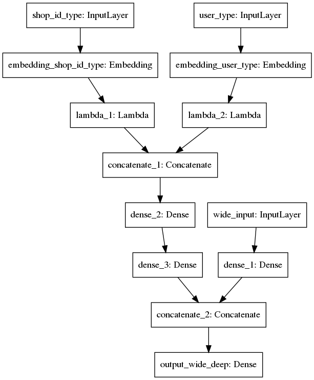
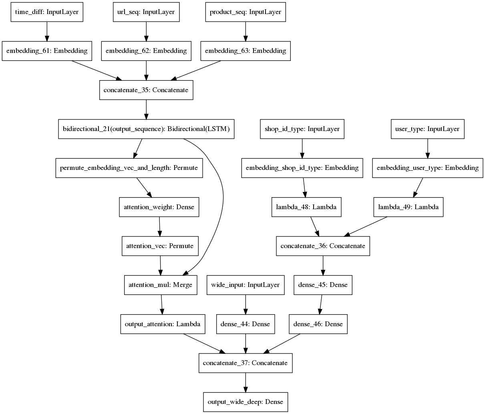
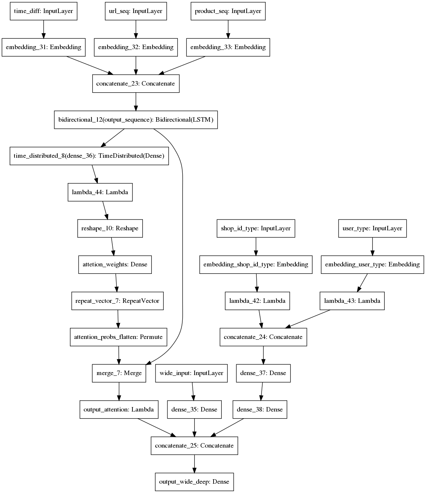

# Wide And Deep Frame
   

Content:  
可以方便定制化的 Wide And Deep 框架， 各种特征编码方式正在完善。

Include:  
- [x] **Wide And Deep Model**
- [x] **Sequence Model**
- [x] **Attention Mechanism**

## Wide And Deep Model:  
**example for two deep branch**   
  

## Attention Mechanism 

**simplest attention in Dense**  
  

**simplest multi attention in lstm**     
Attention defined per time series (each TS has its own attention)  
Theory Graph  
  
Code Graph  
   
Application Graph  
  

**Attention shared across all the time series**  
Theory Graph
  

**disadvantage**   
Those method cannot support masking in embedding.    
So I use TimeDistribution instead, there's some diffrents accordingly.  

## Wide And Deep & Sequence & Attention
**example for two deep branch and three sequence branch**  
